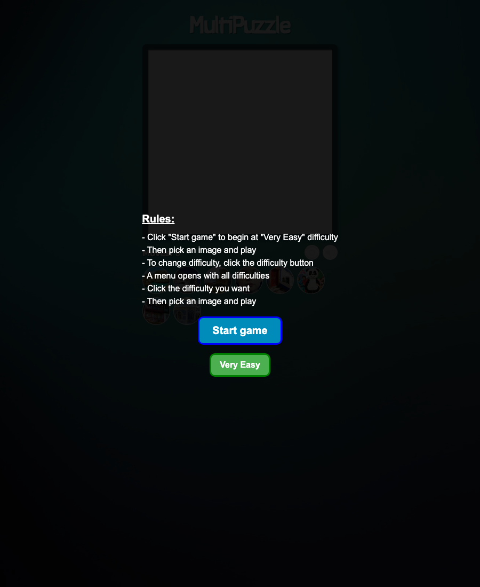
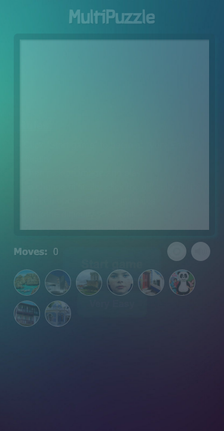
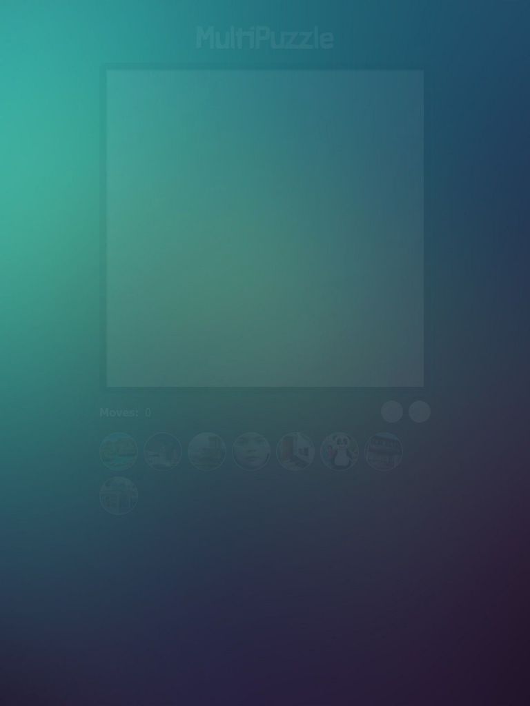
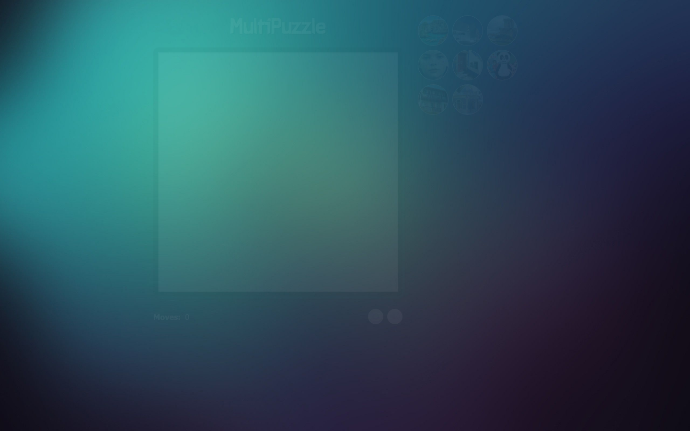

# MultiPuzzle

A sliding-tile puzzle game. Pick one of 8 images, choose a difficulty (3×3 to 6×6), shuffle, and click tiles to slide them toward the empty cell until the picture is restored. Modernized in 2026 from a 2020 vanilla HTML/CSS/JS prototype.



**[Play it →](https://puzzle-production-5cea.up.railway.app)**

<details>
<summary>Other viewports</summary>

| Mobile (375) | Tablet (768) | Wide desktop (1440) |
|---|---|---|
|  |  |  |

</details>

## Stack

- **TypeScript** strict mode
- **Vite** for bundling and dev server
- **Bun** as the package manager and test runner
- **Railpack** for static serving on Railway

## Run locally

```bash
bun install
bun run dev          # http://localhost:5173
```

## Test

```bash
bun test             # game logic unit tests
bun run typecheck
```

## Build

```bash
bun run build        # outputs to dist/
bun run preview      # serve the built bundle locally
```

## Deploy

Pushes to `main` are auto-deployed by Railway. The build runs
`bun install && bun run build`, and Railpack serves `dist/` on the
port Railway provides via `$PORT` (`RAILPACK_STATIC_FILE_ROOT=dist`).

To deploy from the CLI:

```bash
railway up
```

## Project layout

```
src/
  main.ts        bootstrap
  game.ts        pure game logic (DOM-free, unit-tested)
  render.ts      paints the board from GameState
  audio.ts       lazy-loaded sound manager
  ui.ts          events, dropdown, picker, overlay
  types.ts       shared types and constants
  styles.css     responsive styles
public/
  audio/         re-encoded mp3s (background music + SFX)
  images/        puzzle images and UI icons
  fonts/         display font (PiratesWriters.ttf)
```

## Credits

Original 2020 university project (Aplicações Multimédia):
**David Morais · Leonardo Carvalho · Ricardo Silva**.
Original scaffolding © Cláudio Barradas.

Modernized 2026 by Ricardo Silva.
